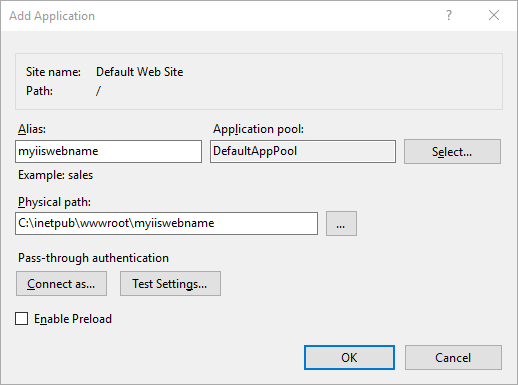

# Suave IIS

Set of helper functions for smooth running [Suave.io](http://suave.io) web server on Internet Information Services (IIS) without common issues like problems with routing on sub-apps, etc...


## IIS Installation

**Please note:** HttpPlatformHandler was replaced by AspNetCoreModule (see the [announcement](https://github.com/aspnet/Announcements/issues/164)) so it is recommended to use this module.

To host Suave.io web application, you need to use **AspNetCoreModule** (allows to use IIS as reverse proxy serving any application). This module should be available on IIS automatically.
If not, please proceed to [AspNetCoreModule official GitHub page](https://github.com/aspnet/AspNetCoreModule)


## Web application installation

**Please note:** Currently **only Suave 2.x.x** version is supported. If you are running on older Suave, choose [Suave.IIS v1.0.0](https://www.nuget.org/packages/Suave.IIS/1.0.0).

Ok, we got IIS ready, now let`s install Nuget package:

    Install-Package Suave.IIS

or using [Paket](http://fsprojects.github.io/Paket/getting-started.html)

    nuget Suave.IIS

To start using IIS helpers in Suave, create own filter functions based on Suave.IIS.Filters & set port to configuration using `withPort` function.

```fsharp
[<EntryPoint>]
let main argv =

    // use IIS related filter functions
    let path st = Suave.IIS.Filters.path argv st
    let pathScan format = Suave.IIS.Filters.pathScan argv format

    // routes
    let webpart =
    	choose [
        	path "/test" >=> OK "Look ma! Routing on sub-app on localhost"
            path "/" >=> OK "Hello from Suave on IIS"
        ]

    // start service server
    let config = { defaultConfig with bindings=[HttpBinding.create HTTP IPAddress.Any 8083us]; } |> Suave.IIS.Configuration.withPort argv
    startWebServer config webpart
    0

```

The last thing we need for proper run on IIS is `web.config`

```xml
<?xml version="1.0" encoding="UTF-8"?>
<configuration>
  <system.webServer>
    <handlers>
      <add name="aspNetCore" path="*" verb="*" modules="AspNetCoreModule" resourceType="Unspecified" />
    </handlers>
    <aspNetCore
	forwardWindowsAuthToken="true"
        startupTimeLimit="20"
        stdoutLogEnabled="true"
        stdoutLogFile="myiiswebname.log"
	processPath="C:\inetpub\wwwroot\myiiswebname\myiiswebname.exe"
        arguments="%ASPNETCORE_PORT% &quot;myiiswebname&quot;">
	<!-- if running on http://localhost/myiiswebname -->
    </aspNetCore>
  </system.webServer>
</configuration>
```

## IIS Application

Now create new web application on IIS:



Copy all your build files into `C:\inetpub\wwwroot\myiiswebnamemyiiswebname` and navigate to `http://localhost/myiiswebname`. You should see your web application output now.

## IIS Site

If you need to run Suave application as Site (on default port 80 or any other port), just **omit second parameter** in arguments attribute of httpPlatformHandler section in `web.config` file:

```xml
<?xml version="1.0" encoding="UTF-8"?>
<configuration>
  <system.webServer>
    <handlers>
      <add name="aspNetCore" path="*" verb="*" modules="AspNetCoreModule" resourceType="Unspecified" />
    </handlers>
    <aspNetCore
	forwardWindowsAuthToken="true"
        startupTimeLimit="20"
        stdoutLogEnabled="true"
        stdoutLogFile="myiiswebname.log"
	processPath="C:\inetpub\wwwroot\myiiswebname\myiiswebname.exe"
        arguments="%ASPNETCORE_PORT%">
	<!-- now running on http://localhost/ -->
    </aspNetCore>
  </system.webServer>
</configuration>
```

## Good to know

1. Maybe you didn\`t notice, but using this library, you can still run Suave locally (from Visual Studio hitting F5 or FAKE script) - it there are no command line arguments, default setup is used, so you don\`t need to change anything. Just use `withPort` and create custom filter functions based on `Suave.IIS.Configuration`.
2. Only few (two, actually :)) filter functions are wrapped in `Suave.IIS.Filters`. If you need more of them, please feel free to send PR.

